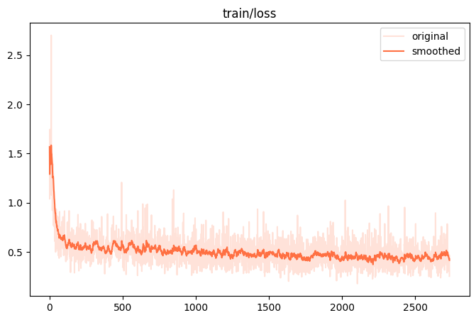
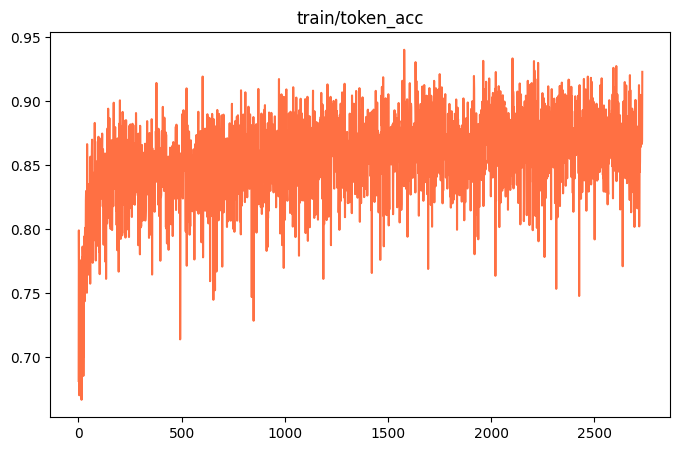
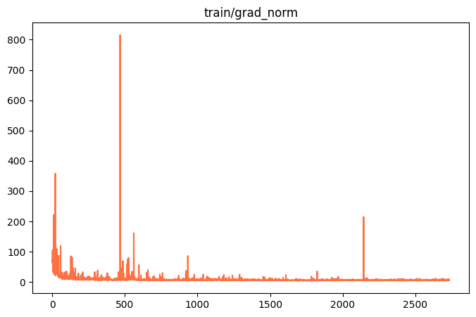
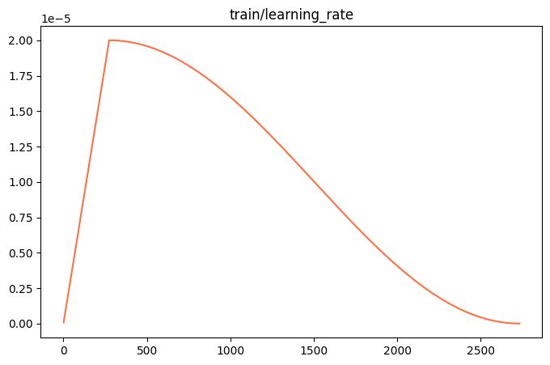

# AI-Challenge-Ovis2_5

**아주소중한딥러닝챌린지: 2025 SW중심대학사업 참여대학 공동 AI 경진대회 - Private LB 1st Place**

[Link to the Slides](https://docs.google.com/presentation/d/1LsFF6c_MLt_YLECrJDcvEYL5hpoAzynfZHubxCSdY4Y/edit?usp=sharing)

This repository contains the code and resources for the 1st place solution in the 2025 AI Challenge. The project focuses on fine-tuning the `AIDC-AI/Ovis2.5-9B` multimodal model to perform a variety of tasks including visual question answering, image captioning, text summarization, and mathematical reasoning.

## Handling Large Files

Due to GitHub's file size limitations, the model checkpoints, processed datasets, and downloaded images are not included in this repository. Please download them from the following links and place them in the appropriate directories.

*   **[Download Checkpoints](https://drive.google.com/file/d/1MkqP48_tDCEAQ0wV5t-jLMcmPNbN2Jih/view?usp=sharing)** -> Unzip and place the checkpoint directory `v0-20250828-230749` into `code/output_dft_loss/`
*   OR, you may use the checkpoint pushed to the huggingface: [Huggingface](https://huggingface.co/chio4696/Ovis-2.5-SFT-2733)
*   **[Download Converted Data](https://drive.google.com/file/d/1HMUs2MQiu8okNZOwsCdFG1c9_PBXifdL/view?usp=sharing)** -> Unzip and place the `.parquet` files into `data/converted/` (You don't need this directory for just an inference.)
*   **[Download Train/Test Ready Dataset](https://drive.google.com/file/d/1kMtcuviMQbMLHtbYl7gIs04fGIJ-tEDL/view?usp=sharing)** -> Unzip and place the `.jsonl` files into `data/dataset/`
*   **[Download Image Data](https://drive.google.com/file/d/1EjHIfgIpWW5jZF2FXDMe6mfWXWxysGlr/view?usp=sharing)** -> Unzip and place each of image directories into `data/image/sample_images`, `data/image/train_images`, and `data/image/test_images`.

---

## Environment Setup

### System Specifications
The model was trained on a machine with the following specifications:
*   **OS:** Ubuntu 22.04.4 LTS (Jammy Jellyfish)
*   **Processor:** 16 vCore
*   **Memory:** 128 GiB
*   **Accelerator:** 1x NVIDIA A100 80GB PCIe
*   **Python:** 3.10.14

### Dependencies
All required Python packages are listed in `requirements.txt`. You can install the necessary packages using pip:
```bash
pip install -r requirements.txt
```
If you are not on the same environment, the flash_attention installation might raise an error. In that case, remove flash_attn line from the `requirements.txt` and install `flash_attn==2.7.4.post1` separately.

---

## Project Structure

```
.
├── code
│   ├── logs
│   ├── output_dft_loss
│   │   └── v0-20250828-230749
│   │       └── checkpoint-2733 (download via Google Drive)
│   └── Ovis2.5-9B.ipynb
├── data
│   ├── converted (download via Google Drive)
│   ├── dataset (download via Google Drive)
│   ├── image (download via Google Drive)
│   └── raw (download via Kaggle competition page)
├── environment.txt
├── prediction
│   └── submission_BEST.csv
├── README.md
└── requirements.txt
```

---

## How to Use (for a Huggingface Transformer Inference)
Let's start with checkpoint download. Since the model is exported from the MS-Swift, you may use the converted/default directory in the HF.
```bash
curl -s https://packagecloud.io/install/repositories/github/git-lfs/script.deb.sh | sudo bash
sudo apt-get install git-lfs
git-lfs clone https://huggingface.co/chio4696/Ovis-2.5-SFT-2733
```

```python
import torch
import requests
from PIL import Image
from transformers import AutoModelForCausalLM
import pandas as pd
import os

IMAGE_PATH = 'AI-Chellenge-Ovis2_5/data/image/'

model = AutoModelForCausalLM.from_pretrained(
    "Ovis-2.5-SFT-2733/converted/default",
    torch_dtype=torch.bfloat16,
    trust_remote_code=True
).cuda()

def inference_on_data(row):
    image_path = ""
    task = row['task']
    question = row['question']
    if task == 'captioning':
        text = 'Generate a single, detailed, and objective descriptive paragraph for the given image. Each description must begin with the phrase "The image is..." or "The image shows...", followed by a structured analysis that moves from the main subject to its details, and then to the background elements. You must use positional language, such as "on the left" or "at the top of the cover" to clearly orient the reader. If any text is visible in the image, transcribe it exactly and describe its visual characteristics like color and style. Conclude the entire description with a sentence that summarizes the overall atmosphere of the image, using a phrase like "The overall mood of the image is...". Throughout the paragraph, maintain a strictly factual, declarative tone with specific, descriptive vocabulary, avoiding any personal opinions or interpretations.'
        image_path = os.path.join(IMAGE_PATH, row['input'])
    elif task == 'vqa':
        text = f'Given a document image and a question, extract the precise answer. Your response must be only the literal text found in the image, with no extra words or explanation.\n\nQuestion: {question}'
        image_path = os.path.join(IMAGE_PATH, row['input'])
    elif task == 'summarization':
        text = f"Generate a summary of the following legislative text. Start with the bill's official title, then state its primary purpose and key provisions. Use formal, objective language and focus on the actions the bill takes, such as what it amends, requires, prohibits, or establishes.\n\nText: {row['input']}"
    elif task == 'text_qa':
        text = f"Given a context and a question, extract the most concise, direct answer from the text. Your answer should be a short phrase, not a complete sentence.\n\nContext: {row['input']}\n\nQuestion: {question}"
    elif task == 'math_reasoning':
        text = f"Given a math word problem, solve the question by generating a step-by-step reasoning process. After detailing all the steps in your reasoning, you must conclude your response by placing the final numerical answer on its own separate line, prefixed with #### .\n\nQuestion: {row['input']}"
    messages = [{
        "role": "user",
        "content": [
            {"type": "image", "image": Image.open(image_path) if image_path else None},
            {"type": "text", "text": text},
        ],
    }]
    
    input_ids, pixel_values, grid_thws = model.preprocess_inputs(
        messages=messages,
        add_generation_prompt=True,
        enable_thinking=True
    )
    input_ids = input_ids.cuda()
    pixel_values = pixel_values.cuda() if pixel_values is not None else None
    grid_thws = grid_thws.cuda() if grid_thws is not None else None
    
    outputs = model.generate(
        inputs=input_ids,
        pixel_values=pixel_values,
        grid_thws=grid_thws,
        enable_thinking=True,
        enable_thinking_budget=True,
        max_new_tokens=8192,
        thinking_budget=4096,
    )
    
    return model.text_tokenizer.decode(outputs[0], skip_special_tokens=True), text

test_df = pd.read_parquet("AI-Chellenge-Ovis2_5/data/converted/deep_chal_multitask_dataset_test_path_converted.parquet") # Should be able to feed the function with local image path
test_df = test_df.groupby('task').head(5) # Simple task-stratified samples

inference_result = dict()
for _, row in test_df.iterrows():
    y, x = inference_on_data(row)
    inference_result[x] = y
    
inference_df = pd.DataFrame(inference_result.items(), columns=['In', 'Out'])
```

## How to Use

Follow these steps to replicate the entire training and inference pipeline.

### Step 1: Data Preparation
Place the raw competition data files into the `data/raw/` directory.

### Step 2: Run the Notebook
Open and execute the cells in the `code/Ovis2.5-9B.ipynb` Jupyter Notebook. The notebook is structured to handle the entire workflow from data preprocessing to inference.

#### a. Preprocessing
The initial cells in the notebook download all images from URLs provided in the raw dataset and save them locally to the `data/image/` directory. This step is crucial as it converts the dataset into a format where images are referenced by local file paths, which is necessary for training.

***Note:*** *This preprocessing step can be prone to failures due to network issues or broken URLs. If you encounter problems, please use the pre-processed and converted data files provided in the download links above.*

#### b. Custom Dataset Creation
The script then transforms the preprocessed data into a `.jsonl` format tailored for the MS-Swift training framework. Task-specific prompts are engineered to guide the model's responses for each of the five tasks (captioning, vqa, summarization, text_qa, math_reasoning). During the process, easy (short) text_qa questions and 30% of the text_qa questions will be dropped for stratification purpose. 10% of the whole dataset will be reserved for the validation set additionally.

#### c. Model Training
The training process is divided into two phases using the MS-Swift framework.

1.  **Supervised Fine-Tuning (SFT) with Cross-Entropy Loss:** The model is first fine-tuned on the custom dataset for one epoch. This phase adapts the model to the specific tasks and prompt formats.
2.  **Dynamic Fine-Tuning (DFT) with DFT Loss:** Training is then resumed from the best SFT checkpoint (in this case, `checkpoint-2600`) for a short duration. This phase uses DFT to improve model's CoT chain and penalize the model for selecting low probability token (more like temperature management during training).

The base model used is **AIDC-AI/Ovis2.5-9B**, a powerful multimodal model known for its native-resolution visual perception and strong reasoning capabilities.

#### d. Inference
After training, the final checkpoint (`checkpoint-2733`) is used to generate predictions on the test set. The notebook loads the fine-tuned LoRA adapters and runs inference, saving the results to a `.csv` file in the `prediction/` directory.

---

## Training Results

The model was trained for a total of 2733 steps.

### Final Training Metrics
| Metric | Value |
| :--- | :--- |
| **Total Train Runtime** | 8h 12m |
| **Min Train Loss** | 0.179783 @ 2104/2733 |

The minimum training loss does not serve as a definitive indication of model saturation as the number of examples per task can differ due to randomized batch selection. On the contrary, the model has shown a progressive decrease in the following smoothed training loss plot, which utilized Exponential Moving Average (EMA) with a smoothing weight of 0.9.

### Performance Graphs

The following graphs from the training log illustrate the model's performance during the fine-tuning process.

| Training Loss | Token Acc. | Grad_Norm | LR |
| :---: | :---: | :---: | :---: |
|  |  |  |  |

### Model Details
The fine-tuning was performed using Rank-Stabilized Low-Rank Adaptation (rsLoRA) with PISSA initialization to efficiently adapt the large model.

*   **Total Parameters:** 9,350M ≈ 9.4B
*   **Trainable Parameters:** 174.59M (1.87%)
